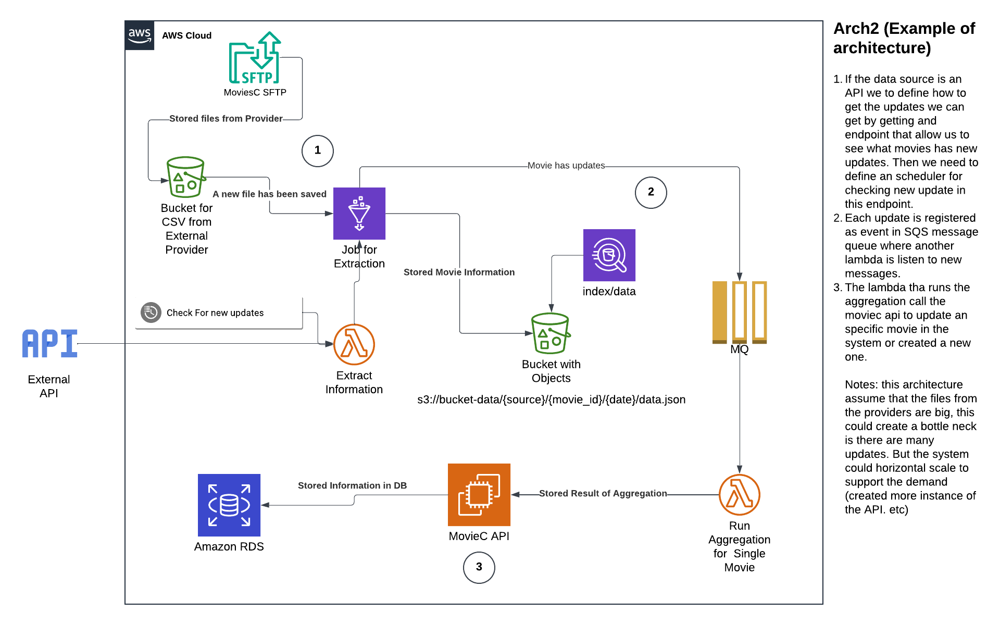

# Movie-C Solution


**MovieC** as an aggregator platform that calculates an aggregate version of movies from different data sources. Is using web with event driven capabilities architecture. 

## Assumptions

The system is desigined based in the following assumptions:

- A movie is update regularly by each data source. 
- The movies contains a unique id that is shared through all data sources. (movie_id)
- MovieC works as a broker for information for another websites.

## Architecture

The architecture is divided in 3 systems:

- [web system](#architecture-web)
- [extractor](#architecture-extractor)
- [aggregator](#architecture-agregator)

### Architecture Web

I choose to use a web architecture because allow to centralize business logic in one single executor, it is easy to make adjustments and improvements and also centralizes the monitoring of the system.

Also one key advantage is that the core aggregation mechanism is not part of the web system making it more robust to failure from the aggregator system


- **Database**: Saved all the data need by the system to stored the aggregated information from all the data sources
- **Bucket**: Store assets like images, or small videos or trailers if is need it. 
- **API**: it contains the backend and the apis that support the web page. 
- **Website**: contains all the assets for web distribution through a web browser. 

**Notes**: Using a relation database we can protect the data updates by accesing only through API.

### Architecture Extractor

The Extractor gets the data from data sources and transform in entites that can be used for aggregation.

For creating such process we need to introduce certain concepts that allow us to ensure the quality of the data:

- **Entity Uniqueness**: How to ensure that one movie is the same movie in all data sources? Define a way to identified the movie in a unique way? is there an id that can be used for all the data sources? The system needs to define an algorithm that can be used for all the data sources to be able to match them (is this movie A the same movie A in this data source?)

```python
def get_movie_id(args)
    # return a movie id. 
    return args["id"]
```
A `movie id` is an id that can be used for matching movies in all data sources. 

Note: This is going to cover the majority of the movies, but there is always going to be some movies that we can not match between data sources, Is suggested to have a log table where we can check what movies are we not able to get the id, and what is the porcentage in the overall data source. 

*For continue the system i assume that all the titles from the original country are the same for all data sources and the dates of registration are unique*

- **Metadata**: What data is relevant and how the metadata can be override. Define rules for each field that defines a movie, also consider scenarios what happened if the data rewrites information as empty or not data should we also saved as empty?

We can define the same blueprint for all data sources pipeline:


The source updates can be trigger by an SFTP server or by an scheduler. This can be implemented using technologies like S3 where we can trigger a serverless function when an update happened in one file in the bucket.

Note: For big updates like the first runs, (big csv files for example) in a data sources this can be a task that is not able to be run in a normal container or a serveless function because of the memory restrictions, is suggested to used technologies like spark that can be run serverless in AWS using glue jobs. 

*All data sources needs to follow the same schema*, This allow the system to compare data sources that has similar data and also define what information is strictly important for been able to use it in the aggregation algorithm. This schema is going to define what is a movie in the system:


- Each data sources saves the movie information in the `Aggregated Storage`. 
- Each time there is a **changed** in the data the system is notified through an event `notified_movie_has_updates('movie_id')`. 

### Architecture Agregator

The aggregator is the main part of the sytem that calculates the final scored of a movie. It contains the aggregator algorithm that is going to be used for calculating the final score. 


The aggregator algorithm containes all the rules that are define for each data source and each field to populate a movie entity and stored in db. 

```python
    def get_info_for_movie(movie_id)
        # Get movie info from data sources
        return (imdb_movie, rt_movies ...)

    def calculate_movie_agg(imdb_movie, rt_movies ...)
        # Calculcuate new movie from all data sources
        return MovieC(
            title=get_title(imdb_movie, rt_movies..),
            rating_soundtrack=get_rating_for_soundtracke(imdb_movie, rt_movies...
            ...
        )
    calculate_movie_agg(**get_info_for_movie(movie_id))
```


## Sequence of an Update

Here we can see how an update of a source goes through all the systems:


## Notes in Implementation

The system can be implemented using airflow or lambda functions as a main engine for running extraction But for runing the aggregation is suggested to used a message queue that ensure the order of the updates. This allow to be a more robust system where we can try and re-try operations without putting in risk consistency of the data. This event can be listen by a serverless function that can run the aggregated algorithm and saved the result in database. 

The following diagram explains a potential implementation of the system:





